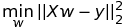
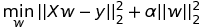
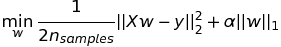
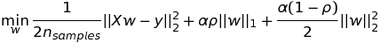

# Concepts learnt
### 9-16-2016
#### OLS (ordinary least square): linear regression in which sum of squared error is minimized. 
> 

#### Ridge regression: penalize large parameters by using following objective function:
> 

#### Lasso regression: like Ridge, but L1, like such:
> 

#### Elastic Net: trade off between Ridge and Lasso by both L1 and L2 regularization.
> 

### 10-6-2016
#### Confusion Matrix, AUC, plotting of ROC curve

