## Text book: 
> [Reinforcement Learning: An Introduction by Richard S. Sutton and Andrew G. Barto](http://incompleteideas.net/sutton/book/the-book-2nd.html)
## Online Course:
> RL Course by David Silver [lecture vidoes](https://www.youtube.com/watch?v=2pWv7GOvuf0)

## Book notes
simplified table of contents:  
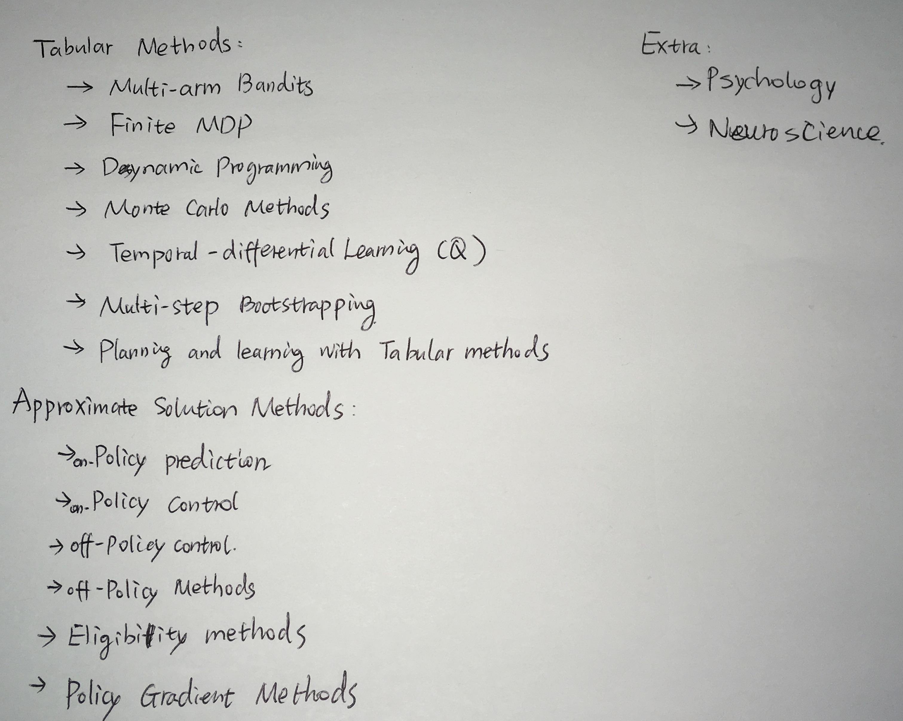

### Chapter1: the reinforcement learning problem
Learning from interaction with environment and maximum final reward

Three parallel methods
> Supervised machine learning  
> Unsupervised learning: discover underlying structure  
> reinforcement learning: reward seeking

#### 1.3 Elements of Reinforcement Learning
four main subelements:
<ul>
    <li>policy: how does a learning agent behave at a given time, mapping perceived states of environment to actions to be taken in those states</li>
    <li>reward signal: what's good in an immediate step</li>
    <li>value function: what's good in the long run</li>
    <li>model of environment
        <ul>
            <li>model-based: planning</li>
            <li>model-free: trial-and-error learners</li>
        </ul>
    </li>
</ul>

#### 1.4 comparing with:
<ul>
    <li>"evolutionary" methods: try all policies and see which one sticks, no value function, just calculate final rewards, no need to sense the state of environment or interact with environment.</li>
    <li>policy gradient methoids: estimate the direction the parameters should be adjusted in order to most rapidly improve a policy's performance</li>
    <li>optimization methods</li>
</ul>

#### 1.5 tick-tac-toe exmaple
evolutionary solution: what's the best move at every possible configuartion of Xs and Os, and an estimate of each policy's winning probablity. hill-climb in policy space, successively generating and evaluating policices in an attempt to obtain incremental improvements. 

RL solution:  
define value function as probability of winning a game when playing X:   
> if there are three Xs in a row then probability of winning is 1  
> if there are three Os in a row or a board is filled up, then the probabaility of winning is 0  
> for all other cases, value function is initialized as 0.5
then greedily update each state's value function to the value of its subsequent states, in other words:  
V(s) <-- V(s) + α[V(s')-V(s)]  
where α is the learning rate and V(s') -V(s) is the learning rate difference before and after state transition. In other words, if state s' has a higher value function than state s, then state s's value function is moved to higher as well. This process is repeated until all value converges. This method works well for tick-tack-toe game.

some disccusions:  
<ul>
    <li>tick-tack-toe has limited states, versus backgammon AI has 10^20 states, and it's impossible to explore even a small fraction of these states. In this situation, neural network provides the abillity to generalize from its experience so that action is taken based on similar experience in the past</li>
    <li>sometimes true states are hidden thus make the problem a lot more difficult</li>
</ul>

#### 1.7 History  

#### Tabular methods:  
<ul>
    <li>Example: Bandit problem (only one state)      </li>
    <li>Problem formulation: Finite Marcovian Decision Process    </li>
    <li>Three classes of methods:      
        <ul>
            <li> dynamic programming  </li>
            <li> monte carlo methods  </li>
            <li> temporal-difference learning</li>
        </ul>
    </li>
</ul>  

### Chapter2: Multi-arm Bandits
Problem: multiple slot machines, each with different reward probablilities that are unknown. How can one maximize reward? Hint: balance exploitation and exploration with reinforcement learning. 

#### 2.2 Simpler methods:
<ul>
    <li>
    greedy: get a sample average of reward function of each bandit and greedily always select the bandit highest estimated reward.  </li>
    <li> epsilon-greedy: like greedy method, but with probablility of epsilon, explore alternative options.  </li> 
</ul>

(I simulated the multi-armed bandit problem as described in the book and implemented epsilon-greedy algorithm [here](https://github.com/MollyZhang/Learning_stuff/blob/master/reinforcement_learning_learning/examples/Multi-armed_bandits.ipynb))

#### 2.3, 2.4 Reward estimation:
<ul>
    <li>
    First, sample average: estimated reward is calcualted as sampled average of all the rewards when action are performed   
    </li>
    <li>
    Second, exponential recent-weighted average, Qn = Qn-1 + α *  (Qn - Qn-1) where α is a constant between (0,1]  
    </li>
    obviously recent-weighted average is better than sample average in nonstationary problems (where reward changes)
</ul>

#### 2.5 optimistic intial value
Overly optimistic initial value estimate helps greedy method because it encourages exploration in the beginning.

#### 2.6 upper confidence bound (UCB) action selection
increases probability to explore action with higher "greedy potential".  
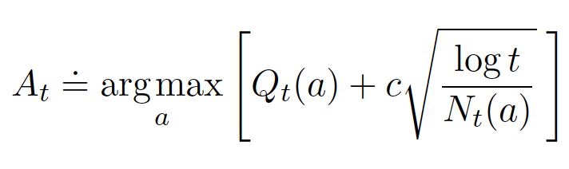

#### 2.7 gradient bandit - SGD update of action preference
<ul>
    <li> Use preference Ht(a) to replace estimated Reward Q(a)  </li>
    <li> the probablility of picking an action is a softmax distribution of each action's preferences:  
         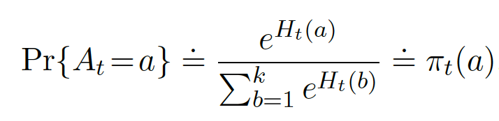   </li>
    <li> preferences can be updated by stochastic gradient descent:  
             </li>
    <li> the book provides a proof of the above algorithm.   </li>   
</ul>

#### 2.8 associate search
Associate search is an intermediate between k-armed bandit problem and the full reinforcement learning problem. Associate search match action to state: chose x arm of the bandit if a color red is shown. If actions are allowered to influence the next state then it's a full reinforcement learning problem. 

#### summary
addtional method: bayesian. Posterior sampling or Thompson sampleling. Very good but computationally infeasible to compute exact solution. 

### Chapter 3. Finite Markov Decision Process
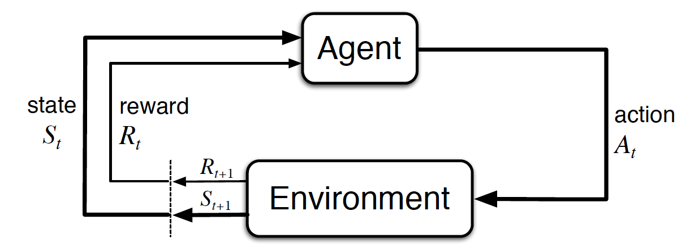   

Three key points:
<ul>
    <li> actions of an agent  </li>
    <li> states of environment  </li>
    <li> reward </li>
</ul>

#### 3.3 returns:
<ul>
    <li> Episodic tasks: episode is a sequence of itneractions that ends with a terminal state. Next episode start with states refreshed regardless of how previous episode ended. This type of tasks are "episodic tasks"  </li>
    <li> Continuing tasks: there is no ending to the task and the final time step could be T-> infinite.  </li>
    <li> In continuing tasks, furture return should be discounted to avoid infinite return, like this:  
        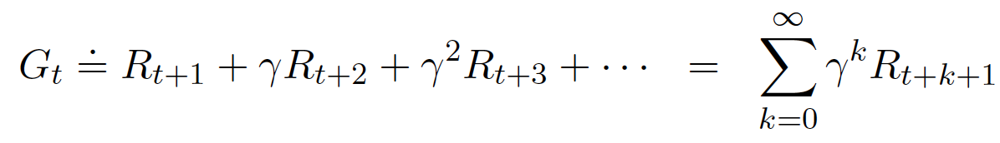   
        where γ is the discounting factor ranging from 0 to 1
    </li>
</ul>

#### 3.5 markov state property

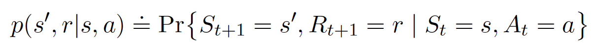   

The current state contains all information to make decision about the future, no past history is needed. This nice property is called markov state property. Example: a canon flying in air, knowing it's velocity and position, it's enough to predict future (don't need it's pass flying trajectory). Not all states satisfy markov state property, for example, in a conversation, what's said in the past does matter to what should be said in the future. However, even if a process is non-markov state, it can be reasonably well represented if assuming a markov state property. 

#### 3.6 Markov decision process
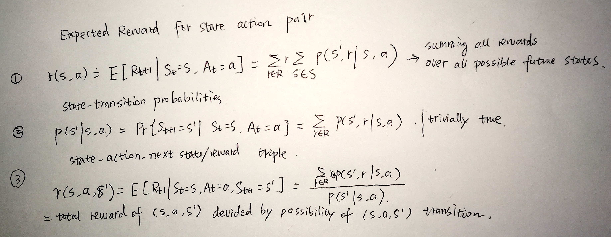   

#### 3.7 value function
value function of a state given policy π (evaluate how good a state is given a policy):  
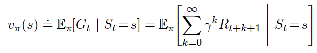   

value function of a (state, action) pair given policy π (evaluate how good of a move is given state and policy):  
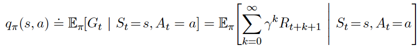   

v_π and q_π can be estimated from sample average of many random actions by "Monte Carlo methods". 

value function can be expressed as "Bellman equation" where value of a state equal to immediate reward plus future reward of next state. Immediate reward equals to summing over reward of all possible (s, a, s') triple given current state, and furture rewad is summing over transition probability from (s, a) to s' and future value function v(s'):  
   

like wise, bellman equation for q(s,a) is expressed as:  
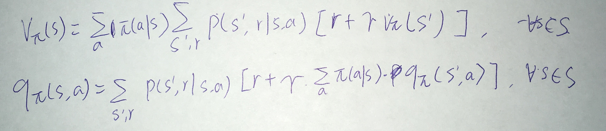   

Example: I implement calculating value function of [gridworld](https://github.com/MollyZhang/Learning_stuff/blob/master/reinforcement_learning_learning/examples/gridworld.ipynb) given random policy. 

#### 3.8 optimal value function
A policy π > π' if and only if Vπ(s) > Vπ'(s) for all s. In that case π is optimal policy which generates optimal value functions. The goal of leanring is to find the optimal policy (and optimal value functions).  
  
These Bellman optimality equations can be explicitly solved by exhaustively looking ahead at all possibilities, such as in the example of the [gridworld](https://github.com/MollyZhang/Learning_stuff/blob/master/reinforcement_learning_learning/examples/gridworld.ipynb) where I analytically computed an optimal value function and best policy. However, this solution relies on three assumptions which are usually not true in practice:  
1. we know the dynamics of the environment. P(s', r|s, a)  
2. we have the resource for computation the computational complexity of bruteforce exhaustive search. 
3. problem satisfy Markov property.  

For tasks that don't meet these three assumptions, approximate solutions are used, which are introduced later in book. 

### Chapter4: Dynamic Programming
Solving the bellman equation directly knowing P(s',r|s,a).

#### 4.1 Policy Evaluation
calcuate value function of each state given policy π  
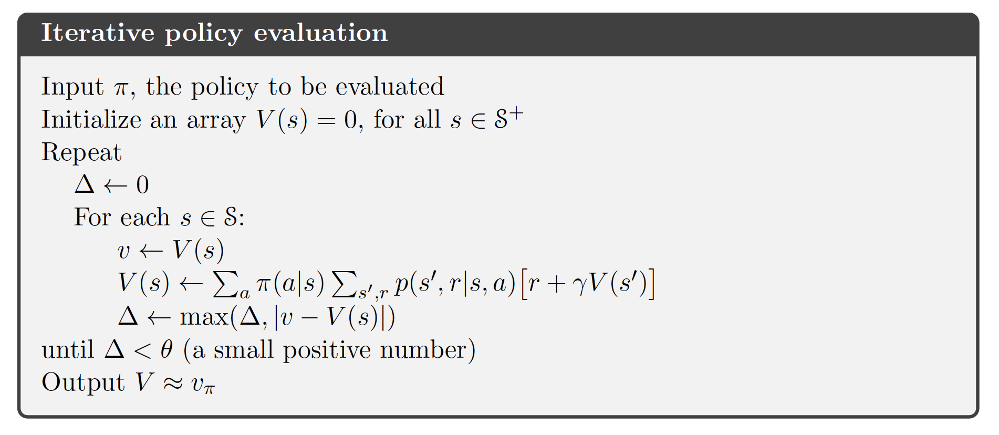  

#### 4.2 Policy Improvement
the book proved a "policy improvement thereom", shown below:  
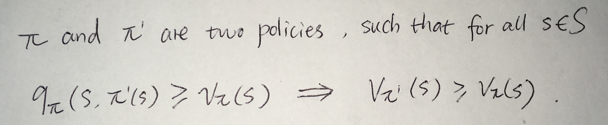  

This means if one were to greedily choose the actions with more reward at each state as shown in this equaltion:
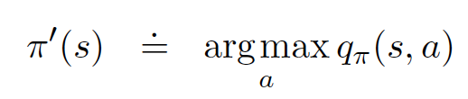, it's going to lead to a policy that's strictly better than a policy not following best action at each state. Therefore a greedy policy is a better policy in the long run as well. 

#### 4.3 Policy Iteration
The general idea of a policy iteration works like this:  
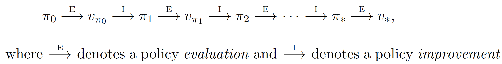  
An intial policy π0 is initialized, an initial value function v0 is calcuated based on π0, then π is updated to pick better actions according to v0, and then v is updated according to new policy. The evaluation step is to calcuate v based on π and the improvement step is to choose π based on v. This process iterates until v is not getting any bigger anymore. The detailed algorithm is shown below:  
  

#### 4.4 Value Iteration
policy iteration could be slow because at each iteration a value function needs to be calculated and then policy is to be updated incrementally. Instead of that, one could simply improve the value function iteratively, and then choose a final optimal policy after getting optimal value function, shown bellow:  
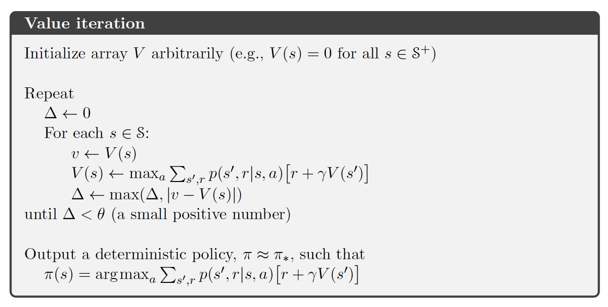   

#### 4.5 Summary
Dynamic programming requires knowing about the model of the environment, which is not often known in real cases. DP also suffers from curse of dimensionality where computational complexity increased exponentially with the number of state variables. 

### Chapter 5: Monte Carlo Methods
Monte carlo methods refers to using random sampling and sample average as a way to estimate value function.  
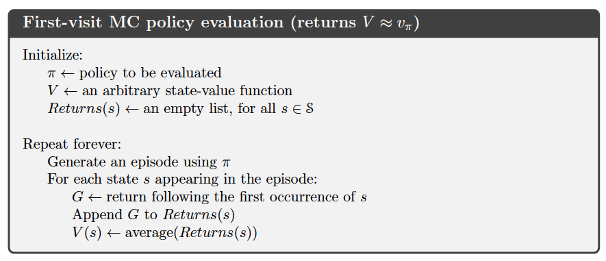   
Compared to dynamic programming, monte carlo methods doesn't need to calculate Pr(s',r|a,s) for all states, and this is great because computationally and conceptually it's much easier.  
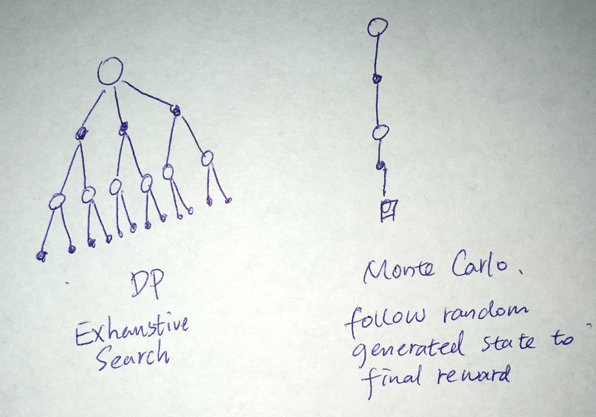   

Without knowing environmental model, it's not enough to just have value of all states, Monte carlo method's primary goal is to estimate q(s,a), and then formulate the optimal policy by choosing the action to maximize q(s,a) for all action at a given state. 

One problem that needs to be addressed: what if not all states are visited? The book provides two solutions:
<ul>
    <li>'exploring starts' where each interaction (episode) is set to start with a specific state and all possible states are used as starting states.
        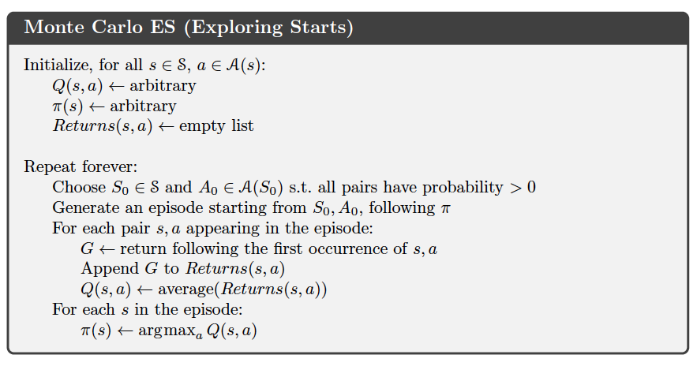   
    </li>
    <li> Instead of a deterministic policy, use a ε-soft policy where at probablilty ε a non-optimal policy action is explored.
        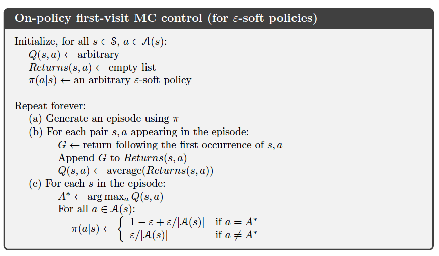 
    </li>
</ul>

#### 5.5 off-policy prediction via importance sampling
<ul>
    <li>On-policy: attempt to evaluate or improve policy that is used to make decisions in collecting data and interacting with environment</li>
    <li>Off-policy: evaluate or improve a policy different fromt hat used to generate the data</li>
</ul>
All the previous monte carlo methods are "on-policy". In an off-policy methods, there is a "behavoir policy" that genrates data, for example, a policy that randomly pick from avaiable actions to encourage maximum exploration, and there is a "target policy" where it's more optimal and we want to learn its the value function, but it's not used to generate data. 

Almost all off-policy methods utilizes "importance sampling":   
Weighting returns according to the relative probability of their trajectories occuring under the target and behavoir policies, and the relative probability is called "importance ratio".  
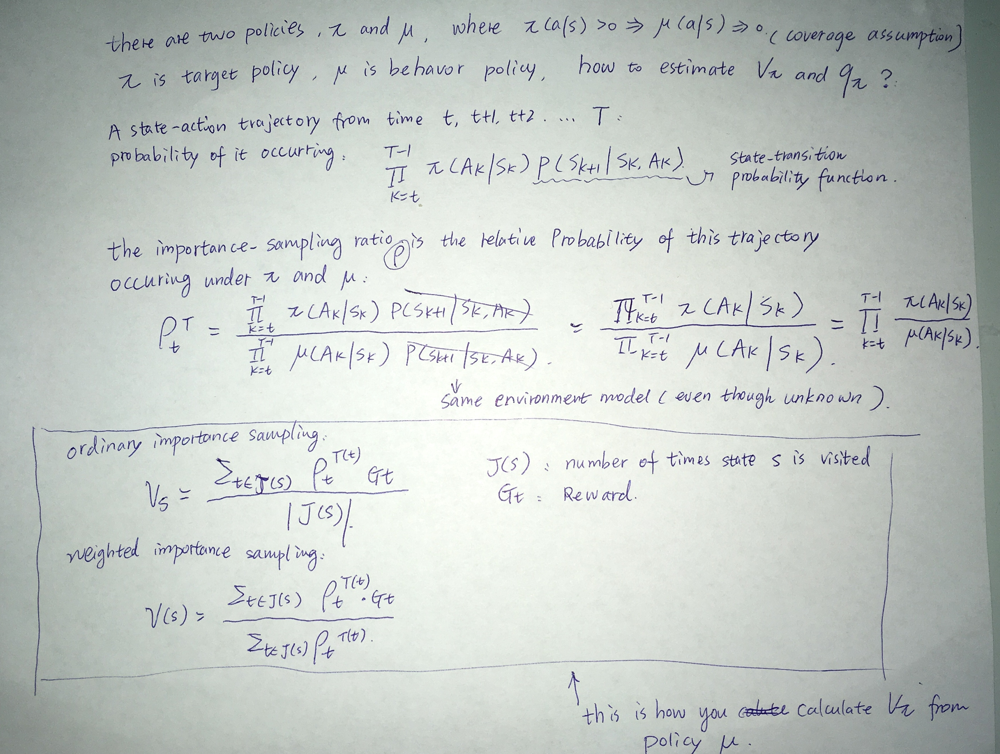 
