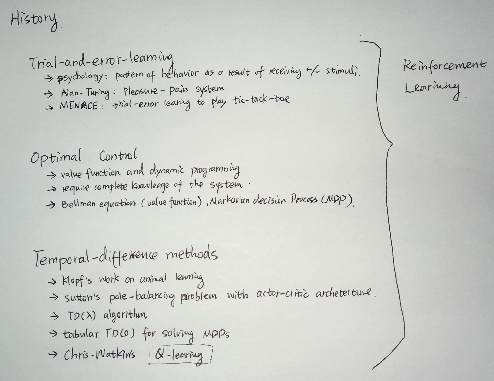

## Text book: 
> Reinforcement Learning: An Introduction by Richard S. Sutton and Andrew G. Barto
## Online Course:
> RL Course by David Silver [lecture vidoes](https://www.youtube.com/watch?v=2pWv7GOvuf0)

## Book notes
### Chapter1: the reinforcement learning problem
Learning from interaction with environment and maximum final reward

Three parallel methods
> Supervised machine learning  
> Unsupervised learning: discover underlying structure  
> reinforcement learning: reward seeking

#### 1.3 Elements of Reinforcement Learning
four main subelements:
<ul>
    <li>policy: how does a learning agent behave at a given time, mapping perceived states of environment to actions to be taken in those states</li>
    <li>reward signal: what's good in an immediate step</li>
    <li>value function: what's good in the long run</li>
    <li>model of environment
        <ul>
            <li>model-based: planning</li>
            <li>model-free: trial-and-error learners</li>
        </ul>
    </li>
</ul>

#### 1.4 comparing with:
<ul>
    <li>"evolutionary" methods: try all policies and see which one sticks, no value function, just calculate final rewards, no need to sense the state of environment or interact with environment.</li>
    <li>policy gradient methoids: estimate the direction the parameters should be adjusted in order to most rapidly improve a policy's performance</li>
    <li>optimization methods</li>
</ul>

#### 1.5 tick-tac-toe exmaple
evolutionary solution: what's the best move at every possible configuartion of Xs and Os, and an estimate of each policy's winning probablity. hill-climb in policy space, successively generating and evaluating policices in an attempt to obtain incremental improvements. 

RL solution:  
define value function as probability of winning a game when playing X:   
> if there are three Xs in a row then probability of winning is 1  
> if there are three Os in a row or a board is filled up, then the probabaility of winning is 0  
> for all other cases, value function is initialized as 0.5
then greedily update each state's value function to the value of its subsequent states, in other words:  
V(s) <-- V(s) + \alpha[V(s')-V(s)]  
where \alpha is the learning rate and V(s') -V(s) is the learning rate difference before and after state transition. In other words, if state s' has a higher value function than state s, then state s's value function is moved to higher as well. This process is repeated until all value converges. This method works well for tick-tack-toe game.

some disccusions:  
<ul>
    <li>tick-tack-toe has limited states, versus backgammon AI has 10^20 states, and it's impossible to explore even a small fraction of these states. In this situation, neural network provides the abillity to generalize from its experience so that action is taken based on similar experience in the past</li>
    <li>sometimes true states are hidden thus make the problem a lot more difficult</li>
</ul>

#### 1.7 History  
 

